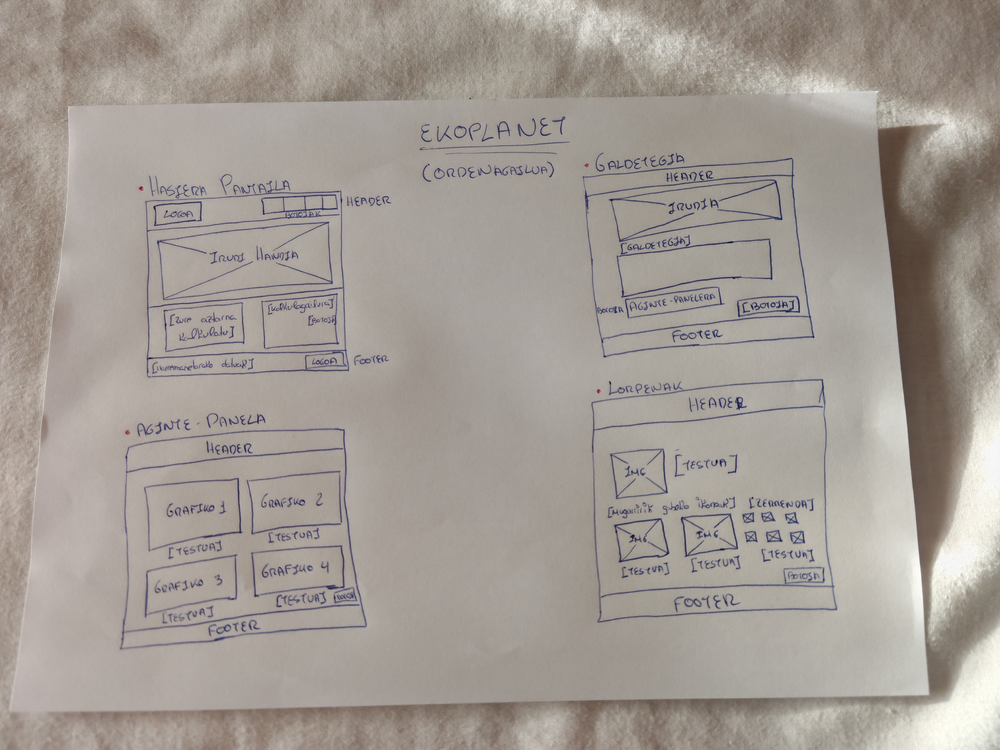
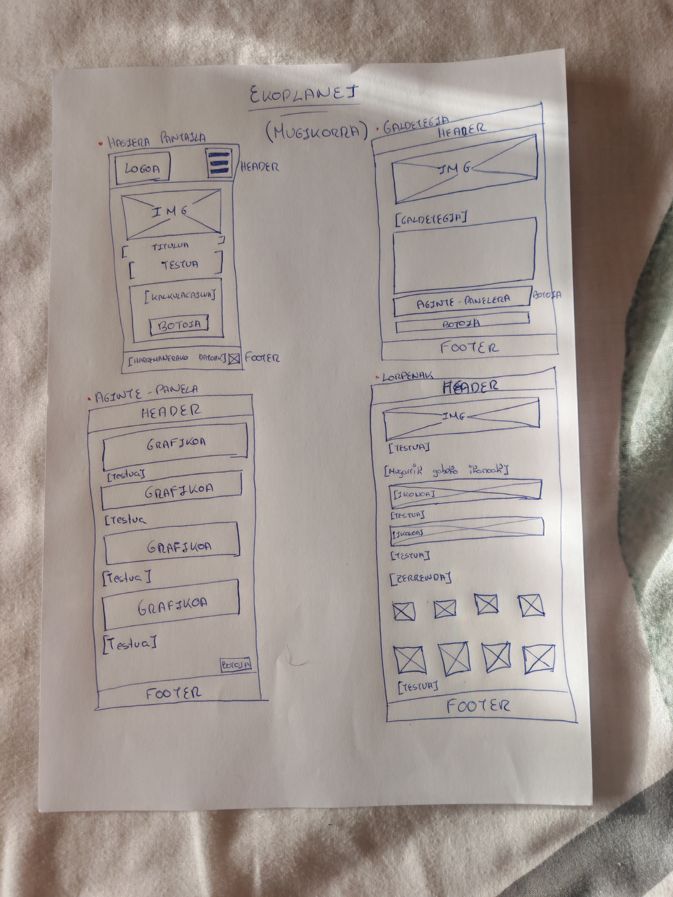
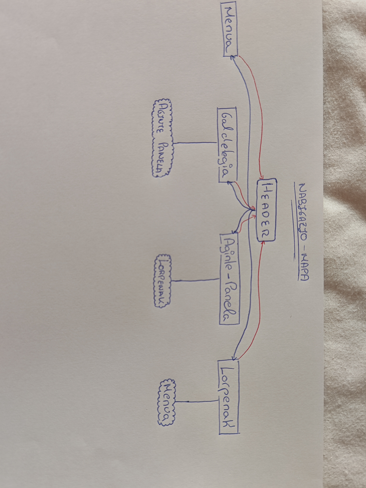

# Ekoplanet- HARKAITZ FERREIRA 

## 1. Sarrera

Gaur egun, funtsezkoa da gure ingurumen-eragina ezagutzea eta etxean energia gutxiago kontsumitzea. Proiektu honen helburua web-plataforma bat sortzea da, erabiltzaileei beren karbono-aztarna kalkulatzen eta etxebizitzan energia aurrezten laguntzeko, aholku pertsonalizatuen bidez.

Erabiltzailearen esperientzia hobetzeko, webguneak ezaugarri nagusi hauek ditu:

* **Galdetegi interaktiboak:** Datuak erraz sartzeko.
* **Aginte-panela (Dashboard) eta grafikoak:** Emaitzak eta bilakaera bisualki ikusteko.
* **Lorpen-sistema (Gamifikazioa):** Erronkak gainditzen diren bitartean ohitura jasangarriak bultzatzeko.

Helburua trantsizio ekologikoa modu erraz eta praktikoan sustatzea da.

## 2. Lehiakideak eta Balio Ekarpena

### Lehiakide zuzenak
* **[Giki Zero](https://zero.giki.earth/)**: Karbono-aztarna kalkulatzen du galdetegi erraz batzuen bidez, eta lorpenak zein gomendioak ematen ditu.
* **[Ecologi](https://ecologi.com/)**: Karbono-isuriak gutxitzeko eta zuhaitzak landatzeko webgunea da, panel oso bisualekin eta intsigniekin.
* **[JouleBug](https://joulebug.com/)**: Etxean energia aurrezteko aplikazioa da, eguneroko erronken eta dominen bidez motibatzen duena.

### Ondorioak: Ekoplanet plataformaren abantailak
* **Denak leku bakarrean:** Beste webgune batzuek gauza bakarra egiten dute (adibidez, aztarna orokorra kalkulatu edo erronka puntualak jarri). Gure plataformak, berriz, bi gauzak batera egiten ditu aginte-panel (*dashboard*) bakar batean: karbono-aztarna kalkulatu eta etxeko energia-kontsumoa aztertu.
* **Grafiko errazak eta joko-sistema:** Informazioa grafiko oso argiekin erakusten dugu. Gainera, lorpen-sistema bati esker, erabiltzaileak galdetegiak erantzun ditzake eta ohitura berdeak lortu ditzake modu oso erraz eta intuitiboan.

## 3. Erabiltzaile Profila (User Profile)

### Nori zuzenduta dago webgunea?
Gure plataforma batez ere **gazteei eta heldu gazteei (18-35 urte)** zuzenduta dago, beren etxean bizi direnak edo pisua partekatzen dutenak. Pertsona hauek ingurumenarekin konprometituta daude eta teknologia egunero erabiltzen dute.

### Zergatik profil hau?
* **Teknologia eta gamifikazioa gogoko dituzte:** Errazago erabiltzen dituzte aplikazio interaktiboak, grafikoak eta sari-sistemak.
* **Fakturak eta energia aurreztu nahi dituzte:** Etxean independenteak izaten hasten direnez, garrantzitsua da guretzat dirua eta energia nola aurreztu ikastea.
* **Ingurumenarekiko kontzientzia dute:** Beren karbono-aztarna murriztu nahi dute, baina modu erraz, praktiko eta azkar batean egin nahi dute, testu luzeegiak irakurri gabe.

## 4. Croquis / Diseinua

Plataformaren interfazearen egitura eta diseinu bisuala definitzeko, croquis desberdinak garatu dira, ordenagailuko eta mugikorreko bertsioetarako egokituta:

### Ordenagailuko Bertsioa (Desktop)

### Mugikorreko Bertsioa (Mobile)

## 5. Nabigazio Mapa

Webgunearen barne-egitura eta orrien arteko konexioa hobeto ulertzeko, nabigazio-mapa garatu da. *Header* nagusiaren bidez erabiltzaileak atal nagusi guztietara (Galdetegia, Aginte-Panela, Lorpenak eta Menua) bideratu daiteke modu azkar eta intuitiboan.

